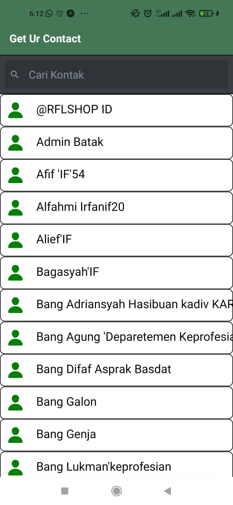
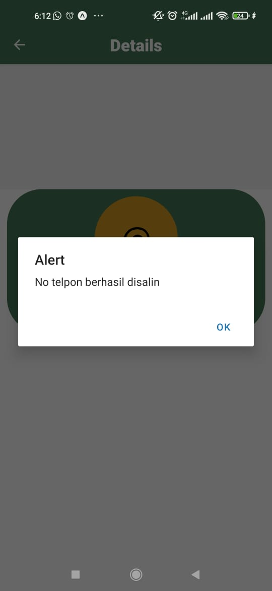
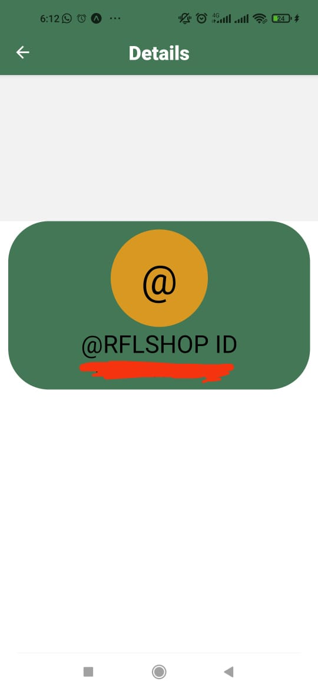

<h1 align=center>UTS PAM</h1>

<h2 align=center>Contac App</h2>

Dibuat Oleh

👇

<b>NAMA:</b> Duta Rega Rolindo Simorangkir

<b>NIM:</b> 120140135

<b>KELAS:</b> RA

## Deskripsi Aplikasi

Aplikasi yang saya buat yaitu contact App, pada Aplikasi ini pengguna bisa mencari Kontak yang sudah ada didalam device pengguna dan juga pada Aplikasi Kontak ini pengguna bisa menyalin nomor kontak untuk dibagikan dan lain-lain

## Daftar Package untuk membangun Aplikasi

- expo-contacts (<a href="https://www.pygame.org/news">https://docs.expo.dev/versions/latest/sdk/contacts/</a>)
- expo-clipboard (<a href="https://www.pygame.org/news">https://docs.expo.dev/versions/v46.0.0/sdk/clipboard/</a>)
- react-navigation (<a href="https://www.pygame.org/news">https://docs.expo.dev/versions/v46.0.0/sdk/clipboard/</a>)

## Cara menjalankan Aplikasi

- Syarat utama yaitu sudah mengintal node.js dan juga git

- #### Clone Repository, Masuk ke folder project dan install package

bash
git clone https://github.com/rajastra/Tap-Tap-Defense

cd Tap-Tap-Defense

npm install

- ### Menjalankan Aplikasi

bash
npm start

## Penjelasan Feature

- Search untuk mencari kontak
- Ketika mengklik nomor telepon , otomatis nomor telepon akan tersalin ke clipboard pengguna

## ScreenShoot Aplikasi

- Noted , yang dicoret merah itu nomor telepon

